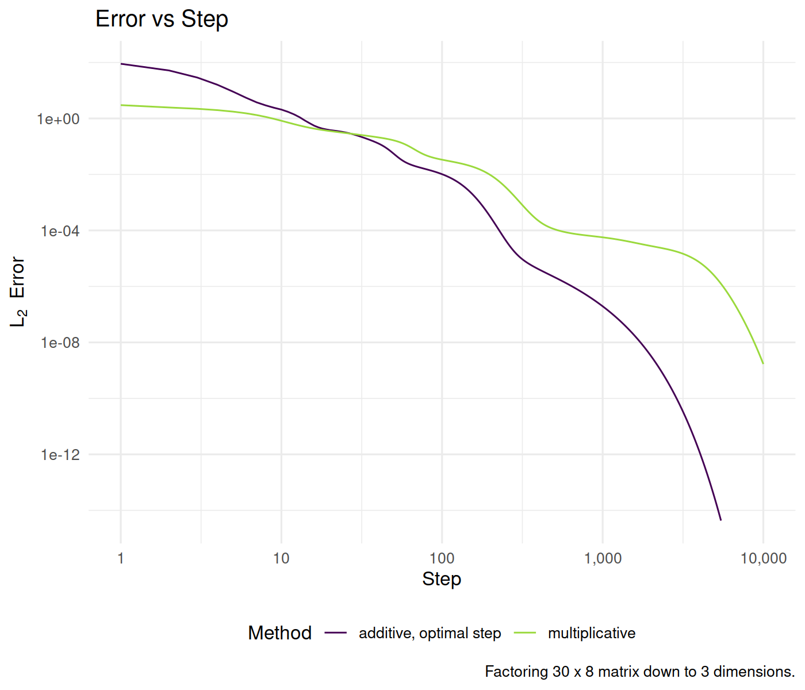

# rnnmf


Implements regularized non-negative matrix factorization by a method similar to 
Lee & Seung, "Algorithms for Non-negative Matrix Factorization," 2001.

-- Steven E. Pav, shabbychef@gmail.com

## Installation

This package may be installed from CRAN; the latest version may be
found on [github](https://github.com/shabbychef/rnnmf "rnnmf")
via devtools, or installed via [drat](https://github.com/eddelbuettel/drat "drat"):


``` r
# CRAN
install.packages(c("rnnmf"))
# devtools
if (require(devtools)) {
    # latest greatest
    install_github("shabbychef/rnnmf")
}
# via drat:
if (require(drat)) {
    drat:::add("shabbychef")
    # not yet: install.packages('rnnmf')
}
```

# What is it?

Non-negative matrix factorization is a tool for decomposing a non-negative
matrix $Y$ approximately as $Y \approx L R$ for non-negative matrices $L, R$ of
pre-specified rank.
This package provides code for non-negative matrix factorization with penalty
terms for the $\ell_1$ and $\ell_2$ norms of the two factors, as well as
for non-orthogonality of the factors.
The code is based on the conceptually simple multiplicative update of 
[Lee & Seung](http://papers.nips.cc/paper/2861-algorithms-for-non-negative-matrix-factorization.pdf).
An additive update based on the same ideas is also given.

This code is provided mostly for research purposes, and no warranty is given
regarding speed, or convergence.

# Basic Usage

We demonstrate the usage of the multiplicative and additive updates in
factoring a small matrix which we constructed to be the product of two
reduced rank non-negative matrices.


``` r
library(dplyr)
library(rnnmf)
library(ggplot2)

frobenius_norm_err <- function(Y, L, R) {
    sqrt(sum(abs(Y - L %*% R)^2))
}
runifmat <- function(nr, nc, ...) {
    matrix(pmax(0, runif(nr * nc, ...)), nrow = nr)
}
test_a_bunch <- function(Y_t, L_0, R_0, niter = 10000L) {
    iter_hist <- new.env()
    iter_hist[["history"]] <- rep(NA_real_, niter)

    on_iteration_end <- function(iteration, Y, L, R,
        ...) {
        iter_hist[["history"]][iteration] <<- frobenius_norm_err(Y,
            L, R)
    }
    wuz <- aurnmf(Y_t, L_0, R_0, max_iterations = niter,
        on_iteration_end = on_iteration_end)
    df1 <- tibble(x = seq_along(iter_hist[["history"]]),
        y = iter_hist[["history"]]) %>%
        mutate(method = "additive, optimal step")

    iter_hist[["history"]] <- rep(NA_real_, niter)
    wuz <- murnmf(Y_t, L_0, R_0, max_iterations = niter,
        on_iteration_end = on_iteration_end)
    df2 <- tibble(x = seq_along(iter_hist[["history"]]),
        y = iter_hist[["history"]]) %>%
        mutate(method = "multiplicative")

    retv <- bind_rows(df1, df2) %>%
        mutate(nr = nrow(Y_t), nc = ncol(Y_t), nd = ncol(L_0),
            max_iter = niter)
    return(retv)
}

nr <- 30
nc <- 8
nd <- 3
set.seed(1234)
L_t <- runifmat(nr, nd)
R_t <- runifmat(nd, nc)
Y_t <- L_t %*% R_t

L_0 <- runifmat(nrow(Y_t), nd + 1)
R_0 <- runifmat(ncol(L_0), ncol(Y_t))

test_a_bunch(Y_t, L_0, R_0, niter = 10000L) %>%
    ggplot(aes(x, y, color = method)) + geom_line() +
    scale_x_log10(labels = scales::comma) + scale_y_log10() +
    labs(x = "Step", y = expression(L[2] ~ ~Error),
        title = "Frobenius Norm of Error vs Step",
        color = "Method", caption = paste0("Factoring ",
            nr, " x ", nc, " matrix down to ", nd,
            " dimensions."))
```

<div class="figure">

<p class="caption">plot of chunk basic_simulations</p>
</div>


## See also

* Lee, Daniel D. and Seung, H. Sebastian. [Algorithms for Non-negative Matrix Factorization](http://papers.nips.cc/paper/1861-algorithms-for-non-negative-matrix-factorization.pdf), 2001.
* Pav, Steven E. [System and method for unmixing spectroscopic observations with nonnegative matrix factorization](https://patentscope.wipo.int/search/en/detail.jsf?docId=US42758160), 2012.

